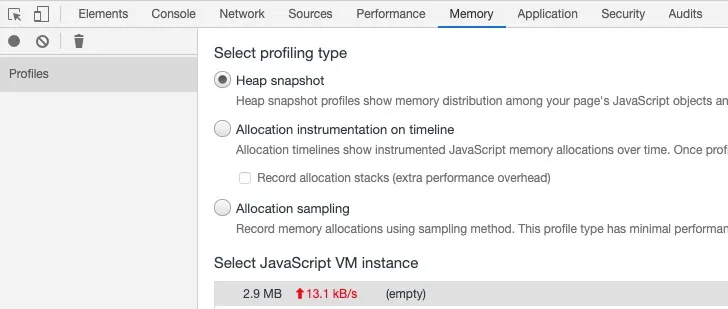

# 关于调试

## 前沿

## 一、关于调试内存

1.首先打开sources，点击需要调试的文件，找到相应的函数，在要测试的函数的一上一下添加两个断点。

<div>

</div>

2.然后刷新一下，js运行到断点位置就会停下来，先触发第一个断点，然后打开memory选项卡，选择heap snapshot选项，然后点击左侧的小灰点，它就会记录当前函数执行前的内存状况，以下三个分别为：
点击F12出来的界面中的【Memory】选项，可以看到三个主要的选项：

> 1、Heap snapshot：堆快照
>
> 2、Allocation instrumentation on timeline：分时段的内存占用
>
> 3、Allocation sampling：分配抽样

<div>

</div>

3.继续点一下页面上的debugger按钮，让第二个断点触发，这时候在点击memory面板的左侧的小灰点，这时候就有两个snapshot了，选择如下图的选项为对比1和2

<div>

</div>

4.找到array，点开array elements，鼠标悬停在下面对应的之前写的arr1上面，就可以看到arr1的情况了

<div>

</div>

5.在右边，可以看到对应的数组arr1的内存使用情况,shallow Size代表栈存储情况，retained Size代表堆存储情况

<div>

</div>

## 二、关于调试代码❤️

<div>

</div>

上图是chrome调试指引

记住如何在network页面下面打开console或者关闭，使用“esc”键

其实还有关于动画的调试，主要应该是对于css呈现的动画的调试吧

# 使用插件

## Vue.js devtools

> 用来调试vue代码

### 0、下载

> 有条件可以microsoft商城下载即可

<div>

</div>

### 1、调试组件

可以看状态树、修改样式、查看props、data等等

<div>

</div>


### 2、调试状态、事件、道具等

比谷歌给的elements多了修改“修改data(),props等状态”更加直观

<div>

</div>

### 3、路由监控

可以调试路由

<div>

</div>

## Console importer

> 调试npm的依赖包，这个是一个非常好用的调试包，就是有个依赖包没有项目想使用api试一试，就可以使用这个插件
>
> 下面是如何安装使用
>
> https://www.5axxw.com/wiki/content/js2ry9


### 下面是引入moment时间格式处理的依赖包案例：

使用插件不报错

```
$i('moment')
moment()
```

<div>
 
</div>
使用插件报错

```
上图报这个错误：Disable Content-Security-Policy

解决办法：

关闭策略

暂时用于console importer
```

<div>
 
</div>


## ajax-interceptor


> 功能对标charles用于拦截请求，串改返回，虽然功能没有charles那么强大

### 使用原因

- 后端不愿意造数据的时候，用它
- 接口返回的数据不理想的时候，用它
- 测试边界值的时候，用它
- 复现 bug 的时候，用它

### 使用

1. ### 使用

   1. 点击上面的chrome商店地址就能直接安装。
   2. 打开插件

   <div>
    <!--  -->
   </div>

   3. 界面介绍

   <div>
    <!--  -->
   </div>

   4. 修改后的界面：

   <div>
    <!--  -->
   </div>

   之后调用后这个接口，这个插件拦截，就会返回你弄好的格式，这样就可以像mock一样返回需要的

## FeHelper(前端助手)

> 拥有的功能
>
> Awesome，All In One的一个工具，包含多个独立小应用，比如：Json工具、代码美化、代码压缩、二维码、Postman、markdown、网页油猴、便签笔记、信息加密与解密、随机密码生成、Crontab等等。**颜色转换工具，网页截屏工具** 

# 本文参考

> https://juejin.cn/post/7307182447065055243?searchId=20231221161704BE8E0E364762371B2AD7
>
> https://juejin.cn/post/7049211255181017102


