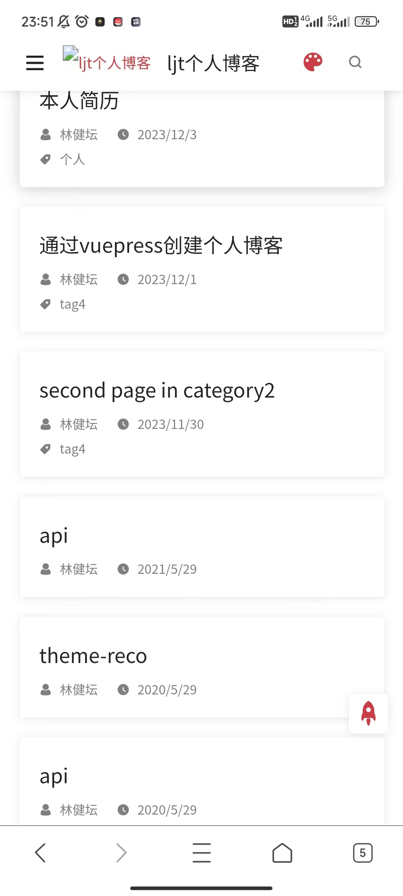
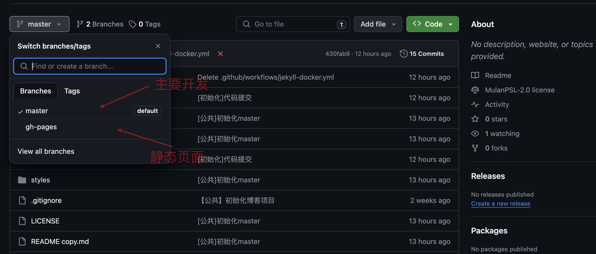
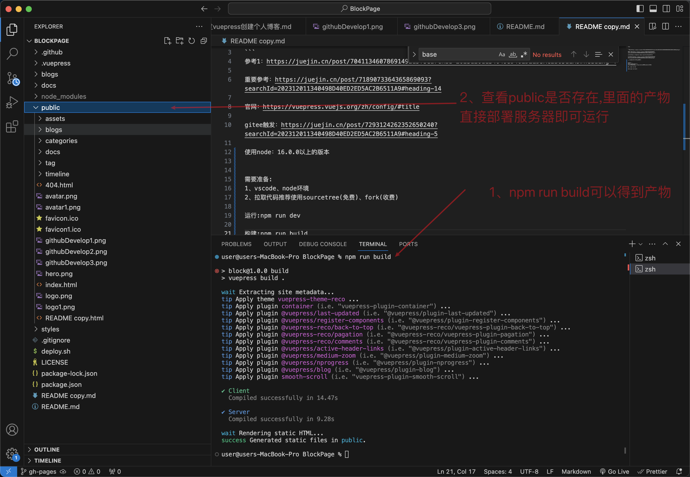
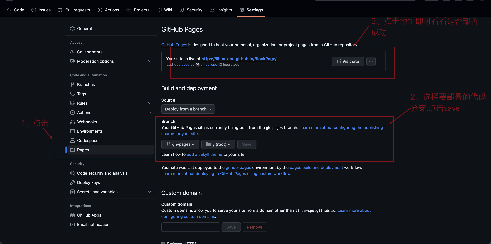

# 前沿

## 地址

本人代码仓库:https://github.com/Lihua-cpu/BlockPage

个人博客地址:https://lihua-cpu.github.io/BlockPage/

## 展示效果

**pc展示效果**


**app展示效果**



# 入门

## 快速开始

------

快速开始[同 VuePress 官网](https://link.juejin.cn/?target=https%3A%2F%2Fvuepress.vuejs.org%2Fzh%2Fguide%2Fgetting-started.html)：

**npx**

```
# 初始化，并选择 2.x
npx @vuepress-reco/theme-cli init
```

**npm**

```
# 初始化，并选择 2.x
npm install @vuepress-reco/theme-cli@1.0.7 -g
theme-cli init
```

**yarn**

```bash
# 初始化，并选择 2.x
yarn global add @vuepress-reco/theme-cli@1.0.7
theme-cli init
```

## 手动安装

```bash
npm install vuepress@next vuepress-theme-reco@next --save-dev

# or
yarn add vuepress@next vuepress-theme-reco@next
// .vuepress/config.ts

import { defineUserConfig } from 'vuepress'
import { recoTheme } from 'vuepress-theme-reco'

export default defineUserConfig({
  theme: recoTheme({
    // options
  })
})
```

## 部署

### 官方部署

> 部署gitee、github是可以的,但是gitee部署需要实名认证,github则不需要.
>
> 官网:https://vuepress.vuejs.org/zh/guide/deploy.html#github-pages


### 23-12-17目前我的部署

> 官网有给出多个平台部署到步骤,但是他只是给出大概部署
>
> 总结起来的脚本就是:
>
> 1、打包——build
>
> 2、进入打包的产物,将打包的产物提到另外的分支
>
> 3、部署关于这个分支的代码到githubpage上
>
> 三个步骤
>
> 如果需要到时候写一下关于“**提交代码立刻触发这个脚本**”的博客


> 因为没有写流水线打包只能手动打包啦
>
> 1、创建分支gh-pages
>
> 2、打包build
>
> 3、将打包产物提交分支gh-pages
>
> 4、开启github的page,然后将服务器指向gh-pages

1、创建分支gh-pages



2、打包build



3、将打包产物提交分支gh-pages


4、开启github的page,然后将服务器指向gh-pages




# 参考

### 1、通过iconfont使用图标

```
https://juejin.cn/post/7242181894116573245
```

### 2、官网

```
https://vuepress-theme-reco.recoluan.com/
```

### 3、从创建到部署

> 这个比较全面,但是有不好的就是,他的部署也是看着官方写的,如果不会部署的,直接自己build,然后把产物直接丢到github,然后就是开启github的githubPage,流水线先别写等熟悉再

```
https://juejin.cn/post/7041134607869149215
```

