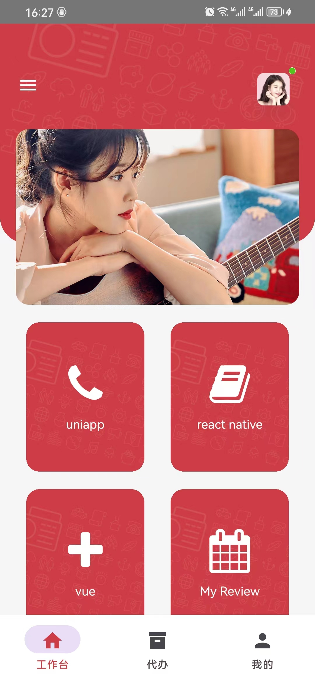
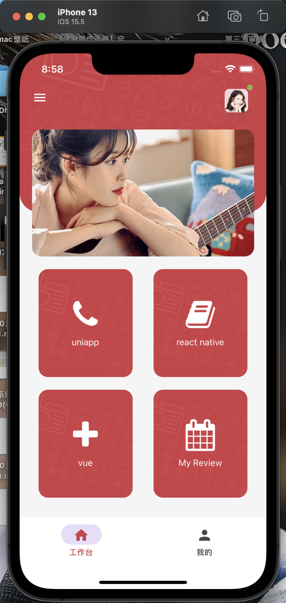
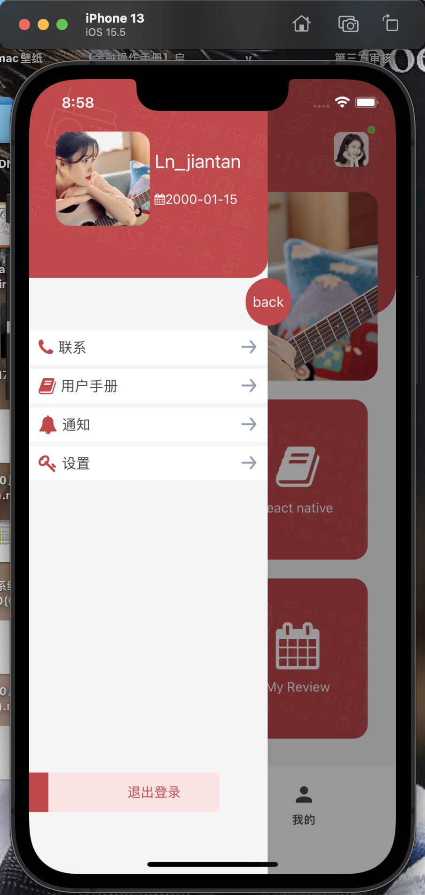
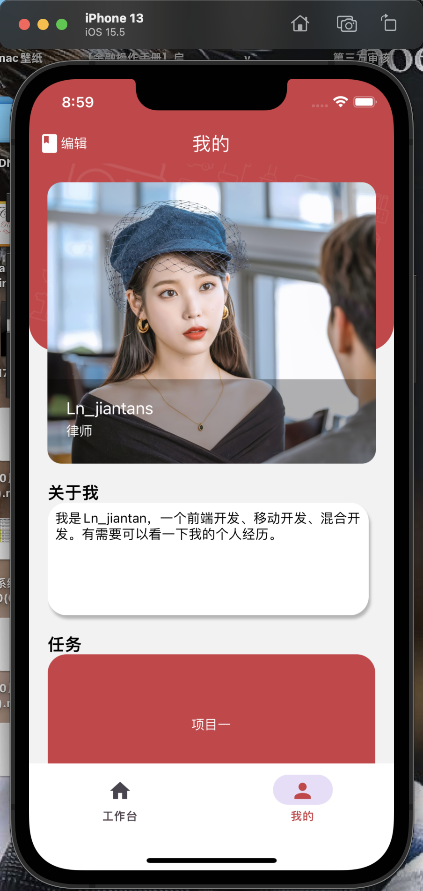
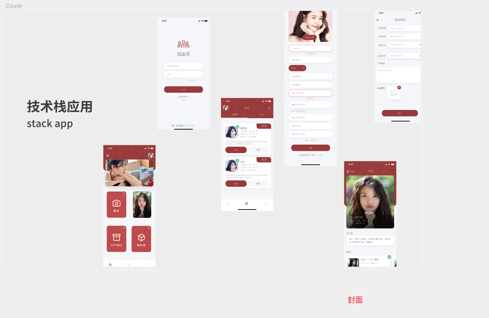
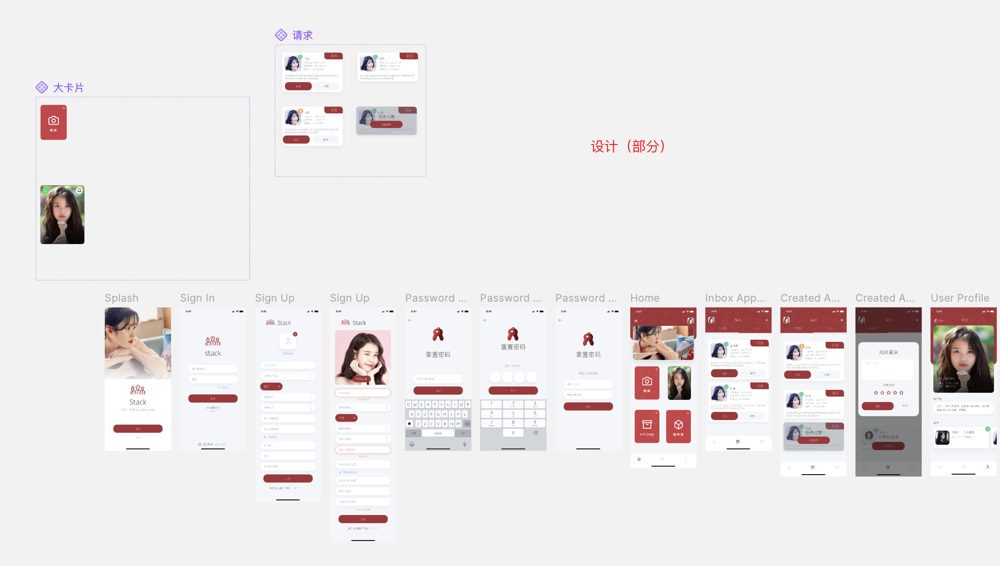

# 前沿

> 能学到：
>
> react native开发
>
> ue、ui的主要工作——画图
>
> app发布


## app下载地址:

- android下载:https://www.pgyer.com/dmrmCn

- iOS:暂无.(说明因为苹果的app需要证书的需要有开发者账号,且账号申请需要钱,目前资金不足无法上架,按道理应该是除了兼容问题其他都能在ios运行的)

## app的安卓效果:

<div>

 
  
</div>


## app的苹果模拟器效果:

<div>

 
  
</div>


## 说明

### 开发说明

react native版本为0.72.4

node环境:16.0及其以上

开发电脑 :最好是mac,

开发工具:vscode、webstorm、Android studio、google、Xcode、以及安卓模拟器、苹果模拟器

发布工具：蒲公英

打包工具：mac（暂时没有）、钉钉（用于通知打包成功）


### 开发目的

1、展示react native如何从零到一

2、展示多技术嵌入该项目(原生技术、uniapp小程序技术、uniapp的h5技术)实现的交互

3、展示一下原生技术的实现,比如地图、语音识别、人脸等等,

4、知识分享(可以看到雏形每一个卡片代表了技术,点击后进入不同技术的分享,包括知识分享、技术方案、解决方案分享)

### 博客说明

1、这是一篇博客、不是文档，所以有可能会掺杂一些口头的标注，一般来说本人喜欢（）包裹

2、【】包裹的一般来说是title、或者说类似于大类的意思

3、这个是最初的稿子、希望之后可以分别出UIUE、app简单开发、app详细开发、app开发文档等如果可以的话可以录制视频，其中肯定会附带比如github的使用、soucetree使用、流水线打包脚本、react native入门、uniapp入门之类的

# UI、UE设计

## 前沿

关于ui、ue设计选择

一般来说公司可能会使用axure、sketch等

> 原型软件：axure、sketch
>
> 在线：mastergo、figma、即时设计、墨刀


## 地址

> https://mastergo.com/goto/wjRKiyvp?page_id=0:2&file=112642066482367 

## 效果

封面

<div>
	
</div>

设计

<div>
	
</div>

规范

<div>
  
</div>

## 使用


# app开发

## 说明

1、开发前提：懂得一点react知识，然后了解生命周期，路由等概念。

2、react native有使用tsx、jsx的，这里采用jsx、其实也可以写tsx，因为有引入编译tsx的

3、【占位符】标记这里应该要出一期关于公司如果开发一款app的流程，比如需求调研、需求分析（这些有点偏向于项目管理的东西）

## 前期架构

### 说明

1、一般第一次用的技术都是搭建了大概稳定的框架后再完善

2、前期架构最好就是早一款社区相对成熟的进行二次开发，没有也最好使用流行的UI组件库

<div style="color:red;background:yellow;">3、从 React Native 0.60 版本开始，引入了 Autolinking 功能，可以使得在 React Native 中集成原生模块更加简单，无需手动链接原生模块</div>

### 整体架构

> mac中使用tree即可生成，可参考：https://segmentfault.com/a/1190000039977971

```
├── App.jsx				app应用
├── App.md
├── Gemfile
├── Gemfile.lock
├── README.md				说明文档
├── android					Android
├── app.json
├── babel.config.js				编译转化
├── index.js				app应用主入口
├── ios				ios入口
├── jest.config.js
├── metro.config.js				用于调试
├── package-lock.json				
├── package.json				依赖、脚本
├── react-native.config.js
├── src				代码入口
│   ├── Action				redux的action
│   ├── Assets				存放静态文件
│   ├── Commom				存放公共
│   ├── Components				存放公共组件
│   ├── Images				存放图片
│   ├── Reducer				redux的reducer
│   ├── RootScreen.jsx				路由页面
│   ├── Router				路由器
│   ├── Screeen				页面
│   └── Store				redux的store
├── tsconfig.json				ts的说明
└── yarn.lock				
```

目前使用组件

```
dayjs —— 用于处理时间格式
react —— 必须的
react-native —— 必须的
react-native-vector-icons -- 
```

【占位符】1、出一个让人知道市场上能选择的UI组件库；目前本人使用的是

## 【占位符】中期架构

> 这个时期的app，需要将一些组件封装得更加完善、方便拓展性。比如按钮、导航栏、

（【23-12-19】暂时未开发得那么深）

# 测试

[暂未开始]


# 完善

待续.....

