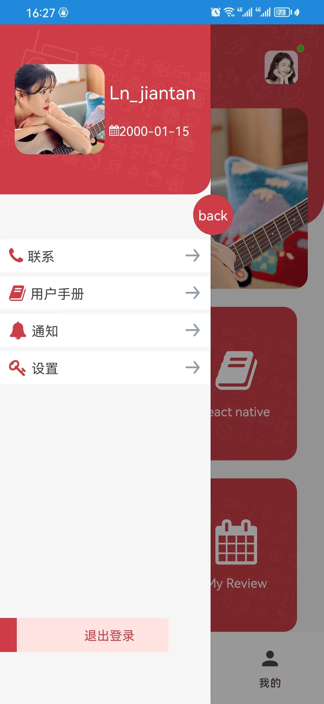
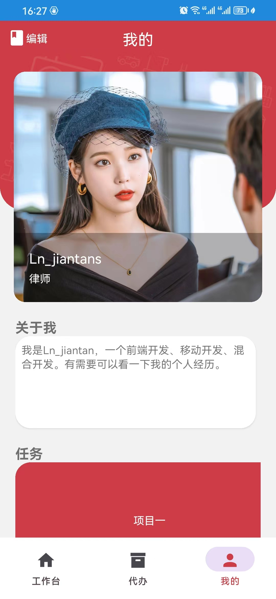

# 前沿

## app下载地址:

- android下载:https://www.pgyer.com/dmrmCn

- iOS:暂无.(说明因为苹果的app需要证书的需要有开发者账号,且账号申请需要钱,目前资金不足无法上架,按道理应该是除了兼容问题其他都能在ios运行的)

## app的安卓效果:

 
  

## app的苹果模拟器效果:

 
  

## 说明

### 开发说明

react native版本为0.72.4

node环境:16.0及其以上

开发电脑 :最好是mac,

开发工具:vscode、webstorm、Android studio、google、Xcode、以及安卓模拟器、苹果模拟器

### 开发目的

1、展示react native如何从零到一

2、展示多技术嵌入该项目(原生技术、uniapp小程序技术、uniapp的h5技术)实现的交互

3、展示一下原生技术的实现,比如地图、语音识别、人脸等等,

4、知识分享(可以看到雏形每一个卡片代表了技术,点击后进入不同技术的分享,包括知识分享、技术方案、解决方案分享)

# UI、UE设计

待续.....

# app开发

待续.....

# 测试

[暂未开始]

# 完善

待续.....

