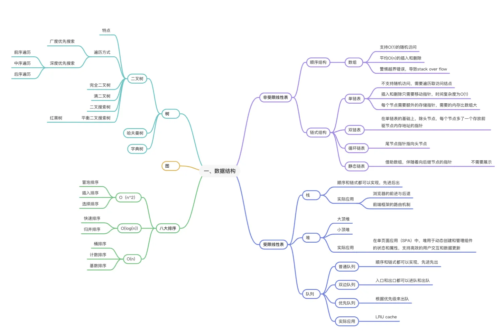
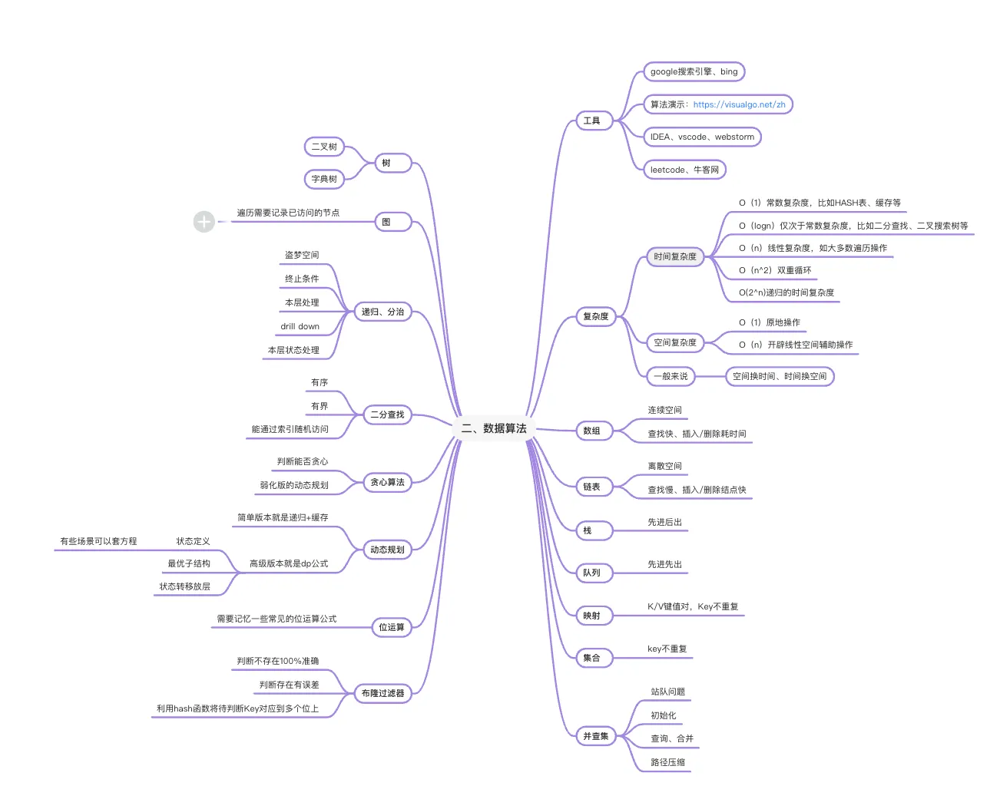
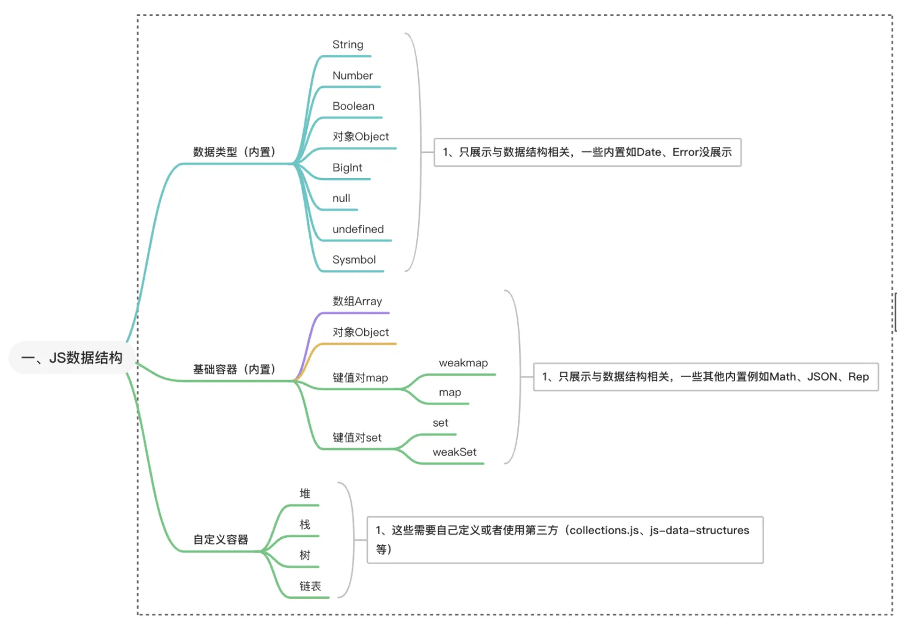

# 一、前沿

## 亮点：

1、思维导图

2、js实现

3、参考资料

4、思维导图里面的算法可视化网站

# 二、思维导图

三个思维导图：前面两个是什么语言都是通用的，第三个是基于js的，可以结合前面两个和js语言特点来实现。

这三个思维导图还是挺有保存意义的

## 计算机数据结构思维导图

<div>
  
</div>

## 计算机算法思维导图

<div>
  
</div>

## JS数据结构

<div>
  
</div>


# 二、概要

先要了解数据结构，在了解算法，然后是相辅相成。因为有些算法是基于数据结构来实现的

js的数据结构有自己的特点，而且内置api有JSON这种与数据结构相关的

# 三、数据结构

## 3.1、非受限数据结构

这个主要是说一些不受条件限制的一些数据结构比如：数组、链表，关于数组，js有提供专门的容器比如Array，但是链表来说，需要自己定义或者第三方

### 数组array

描述

- 主要分为一维数组、二维数组，多维数组
- 优点：随机访问：可以通过索引在 O(1) 时间内快速访问任何元素；内存效率：所有元素存储在连续的内存位置，访问速度较快。
- 缺点：a插入和删除效率低：在数组中间插入或删除元素时，可能需要移动大量元素，时间复杂度为 O(n)。b固定大小：一旦创建，数组的大小通常是固定的，无法动态扩展。

**关于缺点**

主要是js内置了array，扩展数组长度能够看起来无感，其实看源代码，比如java的数组，他的实现ArrayList，里面的对push操作有判断，需要如果超过了就需要分配空间，但是对于js来说可以不固定。

**基于js的操作**

具体可以看说明书：https://developer.mozilla.org/zh-CN/docs/Web/JavaScript

const arr = [1, 2, 3];

- 添加元素

arr.push(4); *// arr 变为 [1, 2, 3, 4]*

arr.unshift(0); *// arr 变为 [0, 1, 2, 3, 4]*

- 删除元素

const last = arr.pop(); *// last 是 4, arr 变为 [0, 1, 2, 3]*

const first = arr.shift(); *// first 是 0, arr 变为 [1, 2, 3]*

- 访问元素

const firstElement = arr[0]; *// 访问第一个元素* 

arr[1] = 5; *// 修改第二个元素*

- 遍历元素

for (let i = 0; i < arr.length; i++) { console.log(arr[i]); }

arr.forEach((element) => { console.log(element); });

- 数组操作

const newArr = arr.slice(1, 3); *// 返回 [2, 3]*

arr.splice(1, 1, 10); *// 从索引1开始删除1个元素并添加10，arr 变为 [1, 10, 3]*

- 查找

const index = arr.indexOf(10); *// 返回 1*

const hasTen = arr.includes(10); *// 返回 true*

- 数组反转与排序

arr.sort(); *// 默认按字符串Unicode顺序排序*

arr.reverse(); *// arr 反转*

- 合并数组

const arr1 = [1, 2]; 

const arr2 = [3, 4]; 

const combined = arr1.concat(arr2); *// [1, 2, 3, 4]*

- 转化数组

const str = arr.join('-'); *// '1-10-3'*

使用场景

- 存列表数据
- 排序和过滤
- 实现队列、栈

### 链表link

具体讲解链表需要单独开文章（TODO）

描述

- 链表也有多种：单链表、双链表、循环链表

js（单链表）实现

```javascript
// 1、新建节点类（Node）
class Node {
  constructor(data) {
    this.data = data; // 节点数据
    this.next = null; // 指向下一个节点的引用
  }
}

// 2、新建链表类（LinkedList）
class LinkedList {
    constructor() {
        this.head = null; // 链表的头节点
        this.size = 0;    // 链表的大小
    }

    // 添加节点到链表末尾
    append(data) {
        const newNode = new Node(data);
        if (!this.head) {
            this.head = newNode; // 如果链表为空，头节点指向新节点
        } else {
            let current = this.head;
            while (current.next) {
                current = current.next; // 遍历到链表末尾
            }
            current.next = newNode; // 将新节点添加到末尾
        }
        this.size++; // 增加链表大小
    }

    // 插入节点到指定位置
    insert(data, index) {
        if (index < 0 || index > this.size) {
            return; // 索引无效
        }
        const newNode = new Node(data);
        if (index === 0) {
            newNode.next = this.head; // 头插
            this.head = newNode;
        } else {
            let current = this.head;
            let previous;
            let count = 0;

            while (count < index) {
                previous = current; // 记录前一个节点
                current = current.next;
                count++;
            }
            newNode.next = current; // 新节点指向当前节点
            previous.next = newNode; // 前一个节点指向新节点
        }
        this.size++;
    }

    // 删除指定位置的节点
    remove(index) {
        if (index < 0 || index >= this.size) {
            return; // 索引无效
        }
        let current = this.head;
        if (index === 0) {
            this.head = current.next; // 删除头节点
        } else {
            let previous;
            let count = 0;

            while (count < index) {
                previous = current;
                current = current.next;
                count++;
            }
            previous.next = current.next; // 前一个节点跳过当前节点
        }
        this.size--;
    }

    // 打印链表
    print() {
        let current = this.head;
        const elements = [];
        while (current) {
            elements.push(current.data);
            current = current.next;
        }
        console.log(elements.join(' -> '));
    }
}
// 3、使用
const list = new LinkedList();
list.append(10);
list.append(20);
list.append(30);
list.print(); // 输出: 10 -> 20 -> 30

list.insert(15, 1);
list.print(); // 输出: 10 -> 15 -> 20 -> 30

list.remove(2);
list.print(); // 输出: 10 -> 15 -> 30
```

使用场景

- 动态大小的数据存储
- 实现队列和栈
- 特定算法的实现（某些算法（如链表排序、合并两个有序链表）直接使用单链表作为基础数据结构，以提高效率。）
- 多线程或异步处理（在需要处理任务队列的多线程或异步环境中，单链表可以用于维护任务的顺序，确保按顺序处理。）
- 图形和游戏开发

## 3.2、受限数据结构

受限的比如栈、队列、堆，但是js没有内置提供专门的api、属性，所以需要自己实现或者第三方

### 栈stack

描述

- 栈的一般限制是先进后出

js实现：

```vue
class Stack {
    constructor() {
        this.items = []; // 存储栈的元素
    }

    // 入栈
    push(element) {
        this.items.push(element);
    }

    // 出栈
    pop() {
        if (this.isEmpty()) {
            return null; // 栈为空，返回null
        }
        return this.items.pop();
    }

    // 查看栈顶元素
    peek() {
        if (this.isEmpty()) {
            return null; // 栈为空，返回null
        }
        return this.items[this.items.length - 1];
    }

    // 检查栈是否为空
    isEmpty() {
        return this.items.length === 0;
    }

    // 返回栈的大小
    size() {
        return this.items.length;
    }

    // 打印栈
    print() {
        console.log(this.items.join(' '));
    }
}

// 使用示例
const stack = new Stack();
stack.push(10);
stack.push(20);
stack.push(30);
stack.print(); // 输出: 10 20 30
console.log(stack.pop()); // 输出: 30
console.log(stack.peek()); // 输出: 20
stack.print(); // 输出: 10 20
```

基本操作

- 入栈（Push）：将元素添加到栈的顶部。
- 出栈（Pop）：移除并返回栈顶部的元素。
- 查看栈顶元素（Peek）：返回栈顶部的元素，但不移除它。
- 检查栈是否为空（IsEmpty）：判断栈中是否还有元素。

常用场景：

- 函数调用管理
- 撤销功能
- 深度优先搜索（DFS）
- 状态管理

### 队列queue

描述

- 队列来说一般是先进先出
- 队列来说是单端队列，也可以双端队列

js实现双端队列：

```vue
class Deque {
    constructor() {
        this.items = [];
    }

    // 从队尾插入元素
    enqueueBack(element) {
        this.items.push(element);
    }

    // 从队首插入元素
    enqueueFront(element) {
        this.items.unshift(element);
    }

    // 从队首移除元素
    dequeueFront() {
        if (this.isEmpty()) {
            return null; // 或者抛出错误
        }
        return this.items.shift();
    }

    // 从队尾移除元素
    dequeueBack() {
        if (this.isEmpty()) {
            return null; // 或者抛出错误
        }
        return this.items.pop();
    }

    // 查看队首元素
    front() {
        if (this.isEmpty()) {
            return null; // 或者抛出错误
        }
        return this.items[0];
    }

    // 查看队尾元素
    back() {
        if (this.isEmpty()) {
            return null; // 或者抛出错误
        }
        return this.items[this.items.length - 1];
    }

    // 检查双端队列是否为空
    isEmpty() {
        return this.items.length === 0;
    }

    // 获取双端队列的大小
    size() {
        return this.items.length;
    }

    // 清空双端队列
    clear() {
        this.items = [];
    }
}

// 使用示例
const deque = new Deque();
deque.enqueueBack(1);
deque.enqueueBack(2);
deque.enqueueFront(0);

console.log(deque.front()); // 输出: 0
console.log(deque.back());  // 输出: 2

console.log(deque.dequeueFront()); // 输出: 0
console.log(deque.dequeueBack());  // 输出: 2

console.log(deque.size()); // 输出: 1
console.log(deque.isEmpty()); // 输出: false

deque.clear();
console.log(deque.isEmpty()); // 输出: true
```

操作：

- enqueueBack：在队尾插入元素。
- enqueueFront：在队首插入元素。
- dequeueFront：从队首移除并返回元素。
- dequeueBack：从队尾移除并返回元素。
- front：查看队首元素但不移除。
- back：查看队尾元素但不移除。
- isEmpty：检查双端队列是否为空。
- size：返回双端队列中元素的数量。
- clear：清空双端队列。

常用场景：

1. 任务调度：在需要优先处理的任务和普通任务之间进行高效管理时，可以将优先任务插入队首，普通任务插入队尾。
2. 缓存实现：如 LRU（最近最少使用）缓存策略，可以使用双端队列来快速地将最近使用的项移动到队首，过期的项可以从队尾移除。
3. 回溯算法：在深度优先搜索（DFS）或某些图形遍历中，可以使用双端队列来存储路径，从而能够在遍历过程中灵活地添加和删除节点。
4. 字符串处理：在需要频繁地从两端添加或删除字符的场景中，比如回文判断，可以使用双端队列来高效管理字符串的状态。
5. 消息队列：在实时系统或网络服务中，双端队列可以用来实现生产者-消费者模式，允许生产者在两端添加消息，消费者则可以从任意一端取出消息。
6. 滑动窗口问题：在处理需要跟踪数据流的滑动窗口问题时，双端队列可以有效维护当前窗口的状态，支持快速插入和删除。


### 堆heap

描述

- 堆是一种特殊的树形数据结构。更具体地说，堆是一种完全二叉树
- 堆是一个完全二叉树，这意味着除了最后一层外，每一层都是完全填满的，最后一层的节点都在左侧
- 堆可以是最大堆或最小堆（最大堆：每个节点的值都大于或等于其子节点的值，最小堆：每个节点的值都小于或等于其子节点的值。）

js的最小堆实现

下面是通过数组array实现的，根据链表的还没实现

```vue
class MinHeap {
    constructor() {
        this.heap = [];
    }

    // 获取父节点索引
    getParentIndex(index) {
        return Math.floor((index - 1) / 2);
    }

    // 获取左子节点索引
    getLeftChildIndex(index) {
        return index * 2 + 1;
    }

    // 获取右子节点索引
    getRightChildIndex(index) {
        return index * 2 + 2;
    }

    // 交换两个元素
    swap(index1, index2) {
        [this.heap[index1], this.heap[index2]] = [this.heap[index2], this.heap[index1]];
    }

    // 向堆中插入元素
    insert(value) {
        this.heap.push(value);
        this.bubbleUp();
    }

    // 上浮操作
    bubbleUp() {
        let index = this.heap.length - 1;
        while (index > 0) {
            const parentIndex = this.getParentIndex(index);
            if (this.heap[index] >= this.heap[parentIndex]) break;
            this.swap(index, parentIndex);
            index = parentIndex;
        }
    }

    // 从堆中删除最小元素
    extractMin() {
        if (this.heap.length === 0) return null;
        if (this.heap.length === 1) return this.heap.pop();

        const min = this.heap[0];
        this.heap[0] = this.heap.pop();
        this.bubbleDown();
        return min;
    }

    // 下沉操作
    bubbleDown() {
        let index = 0;
        const length = this.heap.length;

        while (true) {
            const leftChildIndex = this.getLeftChildIndex(index);
            const rightChildIndex = this.getRightChildIndex(index);
            let smallestIndex = index;

            if (leftChildIndex < length && this.heap[leftChildIndex] < this.heap[smallestIndex]) {
                smallestIndex = leftChildIndex;
            }

            if (rightChildIndex < length && this.heap[rightChildIndex] < this.heap[smallestIndex]) {
                smallestIndex = rightChildIndex;
            }

            if (smallestIndex === index) break;

            this.swap(index, smallestIndex);
            index = smallestIndex;
        }
    }

    // 获取最小元素但不移除
    peek() {
        return this.heap[0] || null;
    }

    // 获取堆的大小
    size() {
        return this.heap.length;
    }

    // 检查堆是否为空
    isEmpty() {
        return this.size() === 0;
    }
}

// 使用示例
const minHeap = new MinHeap();
minHeap.insert(10);
minHeap.insert(5);
minHeap.insert(3);
minHeap.insert(8);

console.log(minHeap.peek()); // 输出: 3
console.log(minHeap.extractMin()); // 输出: 3
console.log(minHeap.peek()); // 输出: 5
console.log(minHeap.size()); // 输出: 3
```

常用场景

堆通常用于实现优先队列，支持高效的插入和删除最大（或最小）元素操作。虽然堆通常用数组实现，但其结构本质上是树形的。

## 3.3、树

主要讲二叉树、哈夫曼树、字典树

1、树是一种逻辑结构，所以基于js能用array、linkList实现，其他语言如java，也可以用ArrayList、linkList实现等

### 3.3.1、普通二叉树（Binary Tree）

- **定义**：普通二叉树是一个每个节点最多有两个子节点的树结构，没有其他特定的约束。
- **特点**：节点的分布没有限制，可以是任何形状。

### 3.3.2、满二叉树（Full Binary Tree）

- **定义**：每个非叶子节点都有两个子节点，且所有的叶子节点在同一层上。
- **特点**：结构非常规则，所有节点都被完全填满。
- **关系**：满二叉树是普通二叉树的一种特例。
- 解释：如何最后子节点没满，就不是满二叉树

### 3.3.3、 完全二叉树（Complete Binary Tree）

- **定义**：除了最后一层外，每一层都被完全填满，最后一层的节点必须从左到右填充。
- **特点**：最后一层可以不满，但节点填充是左对齐的。
- **关系**：完全二叉树也是普通二叉树的一种特例，但它比满二叉树更宽松，因为最后一层可以不满。

js实现：	

```vue
class TreeNode {
    constructor(value) {
        this.value = value;
        this.left = null;
        this.right = null;
    }
}

class CompleteBinarySearchTree {
    constructor() {
        this.root = null;
        this.nodes = []; // 用于保持插入顺序，支持完全二叉树结构
    }

    insert(value) {
        const newNode = new TreeNode(value);
        this.nodes.push(newNode); // 将节点添加到数组中
        
        if (this.root === null) {
            this.root = newNode; // 如果树为空，则新节点为根节点
        } else {
            // 找到父节点
            const index = this.nodes.length - 1;
            const parentIndex = Math.floor((index - 1) / 2);
            const parentNode = this.nodes[parentIndex];

            if (index % 2 === 1) {
                parentNode.left = newNode; // 左子节点
            } else {
                parentNode.right = newNode; // 右子节点
            }
        }
    }

    inOrderTraversal(node = this.root) {
        if (node) {
            this.inOrderTraversal(node.left);
            console.log(node.value);
            this.inOrderTraversal(node.right);
        }
    }

    preOrderTraversal(node = this.root) {
        if (node) {
            console.log(node.value);
            this.preOrderTraversal(node.left);
            this.preOrderTraversal(node.right);
        }
    }

    postOrderTraversal(node = this.root) {
        if (node) {
            this.postOrderTraversal(node.left);
            this.postOrderTraversal(node.right);
            console.log(node.value);
        }
    }
}

// 使用示例
const tree = new CompleteBinarySearchTree();
tree.insert(10);
tree.insert(5);
tree.insert(15);
tree.insert(3);
tree.insert(7);
tree.insert(12);
tree.insert(18);

console.log("In-order traversal:");
tree.inOrderTraversal(); // 应该按照排序顺序输出
console.log("Pre-order traversal:");
tree.preOrderTraversal();
console.log("Post-order traversal:");
tree.postOrderTraversal();
```


### 3.3.4. 二叉搜索树（Binary Search Tree, BST）

- **定义**：一种特殊的二叉树，满足以下条件：对于每个节点，左子树的所有节点的值都小于该节点的值，右子树的所有节点的值都大于该节点的值。
- **特点**：二叉搜索树并不要求每个节点都有两个子节点，也没有层数的限制，但它必须满足排序的性质。
- **关系**：二叉搜索树是一种特殊的普通二叉树，但不一定是满二叉树或完全二叉树。

js实现：

```vue
class TreeNode {
    constructor(value) {
        this.value = value;
        this.left = null;
        this.right = null;
    }
}

class BinarySearchTree {
    constructor() {
        this.root = null;
    }

    insert(value) {
        const newNode = new TreeNode(value);
        if (this.root === null) {
            this.root = newNode; // 如果树为空，设定新节点为根节点
        } else {
            this._insertNode(this.root, newNode); // 从根节点开始插入
        }
    }

    _insertNode(node, newNode) {
        if (newNode.value < node.value) {
            if (node.left === null) {
                node.left = newNode; // 左子树为空，插入新节点
            } else {
                this._insertNode(node.left, newNode); // 递归插入左子树
            }
        } else {
            if (node.right === null) {
                node.right = newNode; // 右子树为空，插入新节点
            } else {
                this._insertNode(node.right, newNode); // 递归插入右子树
            }
        }
    }

    find(value) {
        return this._findNode(this.root, value);
    }

    _findNode(node, value) {
        if (node === null) return false; // 节点为空，未找到
        if (value === node.value) return true; // 找到节点
        return value < node.value
            ? this._findNode(node.left, value) // 递归查找左子树
            : this._findNode(node.right, value); // 递归查找右子树
    }

    inOrderTraversal(node = this.root) {
        if (node) {
            this.inOrderTraversal(node.left);
            console.log(node.value);
            this.inOrderTraversal(node.right);
        }
    }
}

// 使用示例
const bst = new BinarySearchTree();
bst.insert(10);
bst.insert(5);
bst.insert(15);
bst.insert(3);
bst.insert(7);
bst.insert(12);
bst.insert(18);

console.log("In-order traversal:");
bst.inOrderTraversal(); // 按升序输出
console.log("Find 7:", bst.find(7)); // 输出 true
console.log("Find 20:", bst.find(20)); // 输出 false
```

### 3.3.5、总结关系

- **普通二叉树** 是一个广泛的概念，包含所有类型的二叉树。
- **满二叉树** 和 **完全二叉树** 都是普通二叉树的特例，但有各自的结构要求。
- **二叉搜索树** 也是普通二叉树的一种，强调了节点的值的排序特性，而不强调节点的数量或层数的完整性。


## 3.4、图

图接触不是很多，所以很难解释得清楚

## 3.5、其他

### 3.5.1、set

关于set主要是js的es6推出的，主要关注set与weakSet的区别、

记住set里面的数据是不可重复的，所以也能做去重操作

js使用

```vue
const mySet = new Set();
mySet.add(1);
mySet.add({ name: 'Alice' });
console.log(mySet); // Set(2) { 1, { name: 'Alice' } }
```


### 3.5.2、map

# 四、算法

专门独立一章《基于js的算法入门》

# 参考资料

1、https://blog.csdn.net/qq_37255976/article/details/134464573

2、https://developer.mozilla.org/zh-CN/docs/Web/JavaScript/Data_structures
