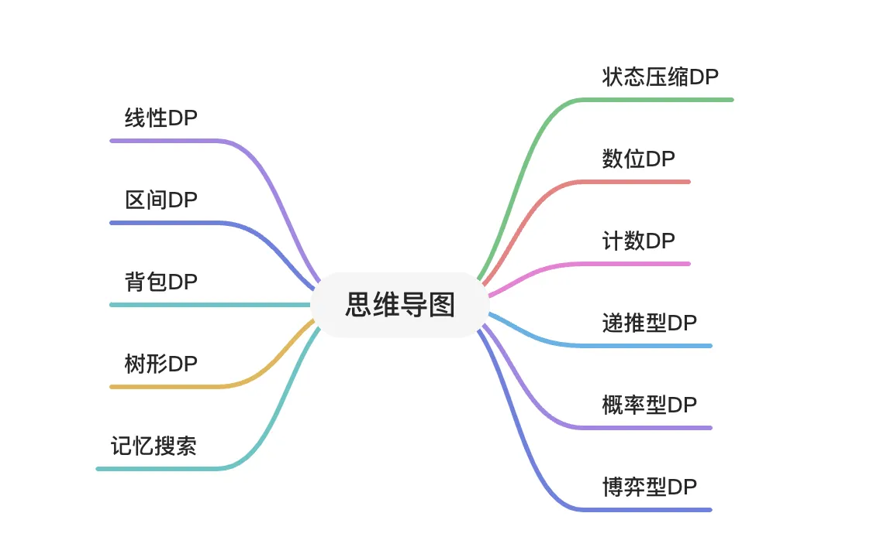

# 概要

# 动态规划的基本思想

动态规划（Dynamic Programming,DP）算法通常用于求解某种具有最优性质的问题。在这类问题中，可能会有许多可行解，每一个解都对应一个值，我们希望找到具有最优值的解。

动态规划算法与分治法类似，其基本思想也是将待求解的问题分解成若干个子问题，先求解子问题，然后从这些子问题的解中 得到原有问题的解。与分治法不同的是，动态规划经分解后得到的子问题往往 不是相互独立 的。

# 动态递归的算法模板

建议打开leetcode经典dp，讲解更详细，最好结合几道经典DP题即可

1.分析最优子结构性质（递推关系）
2.递归定义最优值（动态规划核心）
3.自底向上的方式计算出最优值（动态规划的执行过程）
4.根据计算最优值时得到的信息，构造最优解

# 相关题目

- 采用leetcode-网站
- 将所有的DP问题分成11大类，本文将每一类的题目进行补充，并对这些题目的解法进行探讨。
- 主要经典需要关注的：打家劫舍、股票、字符串序列、回文串
- 需要关注的经典：线性、区间、记忆

  

1、线性 DP

- 最经典单串：

- - 300.最长上升子序列 中等

- 其他单串

- - 32.最长有效括号 困难
  - 376.摆动序列
  - 368.最大整除子集
  - 410.分割数组的最大值

- 最经典双串：

- - [1143.最长公共子序列](https://blog.csdn.net/pl0321/article/details/115507286#longestCommonSubsequence) 中等

- 其他双串

- - [97.交错字符串](https://blog.csdn.net/pl0321/article/details/115507286#isInterleave) 中等
  - [115.不同的子序列](https://blog.csdn.net/pl0321/article/details/115507286#numDistinct) 困难
  - 583.两个字符串的删除操作

- 经典问题：

- - [53.最大子序和](https://blog.csdn.net/pl0321/article/details/115507286#maxSubArray) 简单
  - [120.三角形最小路径和](https://blog.csdn.net/pl0321/article/details/115507286#minimumTotal) 中等
  - [152.乘积最大子数组](https://blog.csdn.net/pl0321/article/details/115507286#maxProduct) 中等
  - 354.俄罗斯套娃信封问题
  - [887.鸡蛋掉落（DP+二分）](https://blog.csdn.net/pl0321/article/details/115507286#superEggDrop) 困难

- 打家劫舍系列: (打家劫舍3 是树形DP)

- - [198.打家劫舍](https://blog.csdn.net/pl0321/article/details/115507286#rob) 中等
  - [213.打家劫舍 II](https://blog.csdn.net/pl0321/article/details/115507286#rob2) 中等

- 股票系列:

- - 121.买卖股票的最佳时机
  - 122.买卖股票的最佳时机 II
  - 123.买卖股票的最佳时机 III
  - 188.买卖股票的最佳时机 IV
  - 309.最佳买卖股票时机含冷冻期
  - 714.买卖股票的最佳时机含手续费

- 字符串匹配系列

- - [72.编辑距离](https://blog.csdn.net/pl0321/article/details/115507286#distance) 困难
  - [44.通配符匹配](https://blog.csdn.net/pl0321/article/details/115507286#isMatch) 困难
  - [10.正则表达式匹配](https://blog.csdn.net/pl0321/article/details/115507286#isMatch2) 困难

- 其他

- - 375.猜数字大小 II

2、区间 DP

5.最长回文子串 中等

516.最长回文子序列

\87. 扰乱字符串 困难

312.戳气球 困难

730.统计不同回文子字符串

1039.多边形三角剖分的最低得分

664.奇怪的打印机

\1246. 删除回文子数组

3、背包 DP

\377. 组合总和 Ⅳ

416.分割等和子集 (01背包-要求恰好取到背包容量)

494.目标和 (01背包-求方案数)

322.零钱兑换 (完全背包)

518.零钱兑换 II (完全背包-求方案数)

474.一和零 (二维费用背包)

4、树形 DP

124.二叉树中的最大路径和 困难

1245.树的直径 (邻接表上的树形DP)

543.二叉树的直径 简单

333.最大 BST 子树

337.打家劫舍 III 中等

5、状态压缩 DP

464.我能赢吗

526.优美的排列

935.骑士拨号器

1349.参加考试的最大学生数

6、数位 DP

233.数字 1 的个数 困难

902.最大为 N 的数字组合

1015.可被 K 整除的最小整数

7、计数型 DP

计数型DP都可以以组合数学的方法写出组合数，然后dp求组合数

62.不同路径

63.不同路径 II

96.不同的二叉搜索树

1259.不相交的握手 (卢卡斯定理求大组合数模质数)

8、递推型 DP

70.爬楼梯

509.斐波那契数

\576. 出界的路径数

\688. “马”在棋盘上的概率

935.骑士拨号器

957.N 天后的牢房

1137.第 N 个泰波那契数

9、概率型 DP

求概率，求数学期望

808.分汤

837.新21点

10、博弈型 DP

策梅洛定理，SG 定理，minimax

翻转游戏

293.翻转游戏

294.翻转游戏 II

Nim游戏

292.Nim 游戏

石子游戏

877.石子游戏

1140.石子游戏 II

井字游戏

348.判定井字棋胜负

794.有效的井字游戏

1275.找出井字棋的获胜者

11、记忆化搜索

本质是 dfs + 记忆化，用在状态的转移方向不确定的情况

329.矩阵中的最长递增路径

576.出界的路径数

# 参考资料

1、https://blog.csdn.net/qq_44398094/article/details/111318003

2、https://blog.csdn.net/pl0321/article/details/115507286
