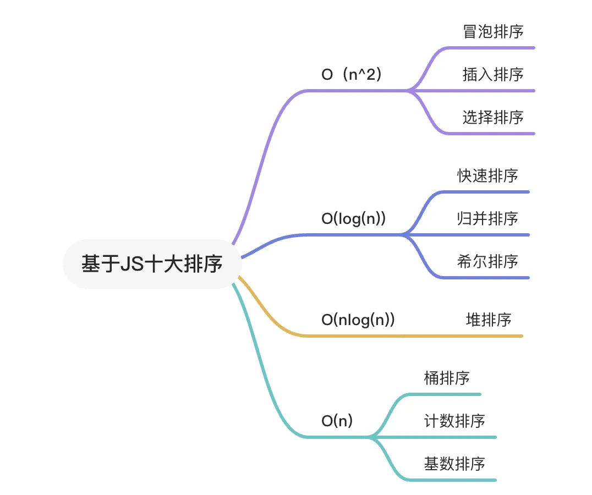

# 前沿

亮点：

1、思维导图

2、例子代码

# 思维导图

<div>
  
</div>

# 概要

- 主要讲解十大排序，基于js实现
- 总结是空间换时间、时间换空间

# 时间复杂度为O（n^2）

## 冒泡排序

js代码实现

```vue
function bubbleSort(arr) {
    const n = arr.length;
    let swapped;

    // 外层循环控制排序的轮数
    for (let i = 0; i < n - 1; i++) {
        swapped = false; // 每一轮开始时假设没有交换

        // 内层循环进行相邻元素的比较和交换
        for (let j = 0; j < n - 1 - i; j++) {
            if (arr[j] > arr[j + 1]) {
                // 交换
                [arr[j], arr[j + 1]] = [arr[j + 1], arr[j]];
                swapped = true; // 记录发生了交换
            }
        }

        // 如果这一轮没有交换，数组已经是有序的，可以提前退出
        if (!swapped) {
            break;
        }
    }

    return arr;
}

// 示例
const arr = [64, 34, 25, 12, 22, 11, 90];
const sortedArr = bubbleSort(arr);
console.log(sortedArr);
```

操作解释

1. 外层循环：控制整个排序的轮数。每次迭代确保至少将一个元素放到正确的位置。
2. 内层循环：比较相邻的元素，如果它们的顺序错误，则交换它们。`n - 1 - i` 是因为每轮后最大的元素会被放到正确的位置，所以可以减少比较的次数。
3. 优化：使用 `swapped` 标志，如果一轮内没有交换，说明数组已经有序，可以提前退出循环，从而提高效率。

## 插入排序

基于js代码实现

```vue
function insertionSort(arr) {
    for (let i = 1; i < arr.length; i++) {
        const key = arr[i];
        let j = i - 1;

        // 将大于 key 的元素移动到右边
        while (j >= 0 && arr[j] > key) {
            arr[j + 1] = arr[j];
            j--;
        }

        // 将 key 插入到合适的位置
        arr[j + 1] = key;
    }
    return arr;
}

// 示例用法
const array = [5, 2, 9, 1, 5, 6];
const sortedArray = insertionSort(array);
console.log(sortedArray); // 输出: [1, 2, 5, 5, 6, 9]
```

操作解释

1. 外层循环：从第二个元素开始遍历数组（索引从 1 开始），将每个元素视为待插入的 `key`。
2. 内层循环：从 `key` 的前一个元素开始，向左遍历已排序部分，将大于 `key` 的元素向右移动一位，为 `key` 腾出位置。
3. 插入：将 `key` 插入到正确的位置。

# 时间复杂度为O（log(n)）

## 快速排序

基于js代码实现

```vue
function quickSort(arr) {
    // 基础情况：数组为空或只包含一个元素
    if (arr.length <= 1) {
        return arr;
    }

    // 选择基准（pivot），这里选择数组的最后一个元素
    const pivot = arr[arr.length - 1];
    const left = [];  // 存放小于基准的元素
    const right = []; // 存放大于基准的元素

    // 遍历数组（不包括基准）
    for (let i = 0; i < arr.length - 1; i++) {
        if (arr[i] < pivot) {
            left.push(arr[i]); // 小于基准的放左边
        } else {
            right.push(arr[i]); // 大于基准的放右边
        }
    }

    // 递归调用快速排序并合并结果
    return [...quickSort(left), pivot, ...quickSort(right)];
}

// 示例用法
const array = [5, 2, 9, 1, 5, 6];
const sortedArray = quickSort(array);
console.log(sortedArray); // 输出: [1, 2, 5, 5, 6, 9]
```

操作

1. 基础情况：如果数组为空或只包含一个元素，则直接返回该数组，因为它已经是有序的。
2. 选择基准：选择数组的最后一个元素作为基准（`pivot`）。
3. 分割数组：遍历数组（不包括基准），将小于基准的元素放入 `left` 数组，大于基准的元素放入 `right` 数组。
4. 递归调用：分别对 `left` 和 `right` 数组进行快速排序，并将结果合并，最后在中间插入基准。

## 归并排序

基于js代码实现

```vue
function mergeSort(arr) {
    // 基础情况：数组为空或只包含一个元素
    if (arr.length <= 1) {
        return arr;
    }

    // 找到中间索引
    const mid = Math.floor(arr.length / 2);
    // 递归分割数组
    const left = mergeSort(arr.slice(0, mid));
    const right = mergeSort(arr.slice(mid));

    // 合并已排序的子数组
    return merge(left, right);
}

function merge(left, right) {
    const result = [];
    let i = 0; // 左边数组的指针
    let j = 0; // 右边数组的指针

    // 合并两个已排序的数组
    while (i < left.length && j < right.length) {
        if (left[i] < right[j]) {
            result.push(left[i]);
            i++;
        } else {
            result.push(right[j]);
            j++;
        }
    }

    // 将剩余元素添加到结果数组
    return result.concat(left.slice(i)).concat(right.slice(j));
}

// 示例用法
const array = [5, 2, 9, 1, 5, 6];
const sortedArray = mergeSort(array);
console.log(sortedArray); // 输出: [1, 2, 5, 5, 6, 9]
```

操作

1. 基础情况：如果数组为空或只包含一个元素，直接返回该数组。
2. 分割数组：通过中间索引将数组分为两个子数组，分别递归调用 `mergeSort` 进行排序。
3. 合并：使用 `merge` 函数将两个已排序的子数组合并成一个有序数组。该函数使用两个指针遍历两个子数组，并比较元素，将较小的元素放入结果数组中。
4. 返回结果：在合并完成后，返回合并后的有序数组。


## 希尔排序

js实现

```vue
function shellSort(arr) {
    const n = arr.length;
    let gap = Math.floor(n / 2); // 初始间隔为数组长度的一半

    // 逐步缩小间隔
    while (gap > 0) {
        // 对每个间隔进行插入排序
        for (let i = gap; i < n; i++) {
            const temp = arr[i]; // 当前要插入的元素
            let j = i; // 当前元素的索引

            // 插入排序
            while (j >= gap && arr[j - gap] > temp) {
                arr[j] = arr[j - gap]; // 移动元素
                j -= gap; // 更新索引
            }

            arr[j] = temp; // 插入当前元素
        }
        gap = Math.floor(gap / 2); // 缩小间隔
    }

    return arr;
}

// 示例用法
const array = [5, 2, 9, 1, 5, 6];
const sortedArray = shellSort(array);
console.log(sortedArray); // 输出: [1, 2, 5, 5, 6, 9]
```

操作

1. 初始化间隔：设置初始间隔为数组长度的一半。
2. 逐步缩小间隔：在 `while` 循环中，逐步减小间隔（gap）。
3. 插入排序：对于每个间隔，进行插入排序。内层循环负责将当前元素插入到正确的位置。
4. 返回结果：完成排序后返回排序后的数组。

# 时间复杂度为O（nlog(n)）

## 堆排序

基于js实现

```vue
function heapSort(arr) {
    const n = arr.length;

    // 构建最大堆
    function buildMaxHeap() {
        for (let i = Math.floor(n / 2) - 1; i >= 0; i--) {
            heapify(i, n);
        }
    }

    // 堆化
    function heapify(i, heapSize) {
        let largest = i;
        const left = 2 * i + 1; // 左子节点
        const right = 2 * i + 2; // 右子节点

        if (left < heapSize && arr[left] > arr[largest]) {
            largest = left;
        }
        if (right < heapSize && arr[right] > arr[largest]) {
            largest = right;
        }
        if (largest !== i) {
            [arr[i], arr[largest]] = [arr[largest], arr[i]]; // 交换
            heapify(largest, heapSize); // 递归堆化
        }
    }

    buildMaxHeap();

    // 进行排序
    for (let i = n - 1; i > 0; i--) {
        [arr[0], arr[i]] = [arr[i], arr[0]]; // 将最大元素放到数组末尾
        heapify(0, i); // 对剩余的元素进行堆化
    }

    return arr;
}

// 示例
const arr = [3, 5, 1, 10, 2, 7];
const sortedArr = heapSort(arr);
console.log(sortedArr);
```

代码解释

1. 构建最大堆：`buildMaxHeap` 函数从最后一个非叶子节点开始，向上调整每个节点，构建出一个最大堆。
2. 堆化：`heapify` 函数确保以 `i` 为根的子树是一个最大堆。它检查当前节点与其左右子节点的值，若有子节点比当前节点大，则进行交换，并递归调整。
3. 排序过程：在 `heapSort` 函数中，将最大元素（根节点）与数组末尾的元素交换，然后对剩余的元素重新堆化，以保证它们依然形成最大堆。

# 时间复杂度为O（n）

## 桶排序

基于js实现

```vue
function bucketSort(arr) {
    if (arr.length === 0) return [];

    // 1. 创建桶
    const minValue = Math.min(...arr);
    const maxValue = Math.max(...arr);
    const bucketCount = Math.floor((maxValue - minValue) / arr.length) + 1;
    const buckets = Array.from({ length: bucketCount }, () => []);

    // 2. 将元素放入桶中
    for (let num of arr) {
        const index = Math.floor((num - minValue) / arr.length);
        buckets[index].push(num);
    }

    // 3. 对每个桶进行排序并合并结果
    return buckets.reduce((sortedArr, bucket) => {
        return sortedArr.concat(bucket.sort((a, b) => a - b));
    }, []);
}

// 示例
const arr = [0.78, 0.17, 0.39, 0.26, 0.72, 0.94, 0.21, 0.12];
const sortedArr = bucketSort(arr);
console.log(sortedArr);
```

代码解释

1. 创建桶：根据数组中的最小值和最大值，计算出桶的数量，并初始化桶数组。
2. 将元素放入桶中：根据每个元素的值计算它应该放入哪个桶中。
3. 排序并合并结果：对每个桶内的元素进行排序，然后将它们合并成一个最终的排序数组。

## 计数排序


基于js实现

```vue
 function countingSort(arr) {
    if (arr.length === 0) return arr;

    // 找到最大值和最小值
    const min = Math.min(...arr);
    const max = Math.max(...arr);
    const range = max - min + 1;

    // 创建计数数组
    const count = new Array(range).fill(0);

    // 计数每个元素出现的次数
    for (let num of arr) {
        count[num - min]++;
    }

    // 累加计数数组
    for (let i = 1; i < count.length; i++) {
        count[i] += count[i - 1];
    }

    // 创建输出数组
    const output = new Array(arr.length);

    // 根据计数数组填充输出数组
    for (let i = arr.length - 1; i >= 0; i--) {
        const num = arr[i];
        output[count[num - min] - 1] = num;
        count[num - min]--;
    }

    return output;
}

// 示例用法
const arr = [4, 2, 2, 8, 3, 3, 1];
const sortedArr = countingSort(arr);
console.log(sortedArr); // 输出: [1, 2, 2, 3, 3, 4, 8]
```

代码解释

1. 找到最大值和最小值：用 `Math.min` 和 `Math.max` 方法找到数组中的最大和最小值，以确定计数数组的大小。
2. 创建计数数组：根据值的范围创建一个计数数组，并用零填充。
3. 计数：遍历原数组，记录每个元素的出现次数。
4. 累加计数：对计数数组进行累加，使得每个位置存储的是该元素在排序后应该出现的最后位置。
5. 填充输出数组：从原数组的最后一个元素开始，根据计数数组确定每个元素在输出数组中的位置，并更新计数数组。
6. 返回结果：返回排序后的数组。

# 参考

主要是收集每个实现js的代码
