## 一、前言

前提

- 需要知道git,github
- 需要

优势：

- 让git命令可视化
- 更加符合生产需要
- 入门更加易懂
- 树状文件结构能让提交代码更清晰

劣势：

- 减少git命令的使用会不适应使用git命令来管理

竞品：

- mac端也有fork这款
- git自己也有可视化的工具适用于window、mac

​	

## 二、source介绍

### 简单介绍

​	Sourcetree 是 Windows 和Mac OS X 下免费的 Git 客户端版本管理工具，Sourcetree拥有一个精美简洁的界面，管理项目方便，可追溯代码编写者及日期，轻松完成项目的代码管理。无需使用git命令，彻底释放双手，提高效率，大大简化了开发者与代码库之间的Git操作方式。

### 功能

- 通过一个简单的用户界面即可使用所有的Git命令
- 通过一次单击，即可管理所有的Git库，无论是托管的还是本地的
- 通过一次单击，即可进行commit、push、pull、merge等操作
- 通过双击，即可切换分支及版本回滚。

## 三、下载与安装

Sourcetree官网地址：[Sourcetree | Free Git GUI for Mac and Windows](https://www.sourcetreeapp.com/)

1.打开对应安装包

	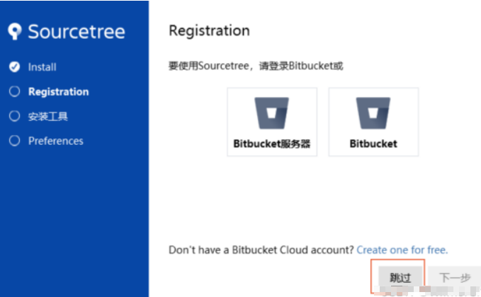

2.安装指引

	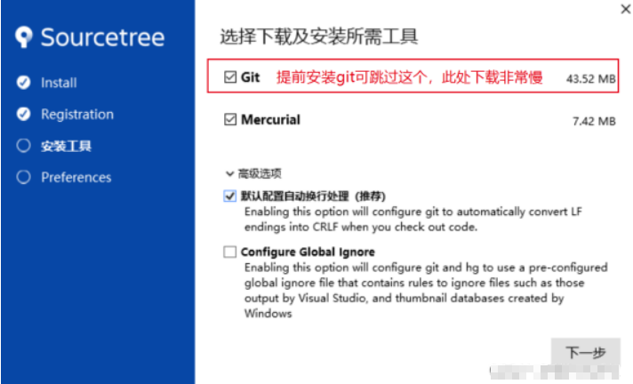

3.显示sourcetree安装成功

	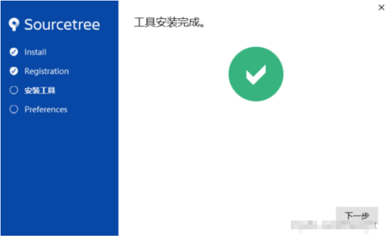

4.配置git的名称、邮箱

	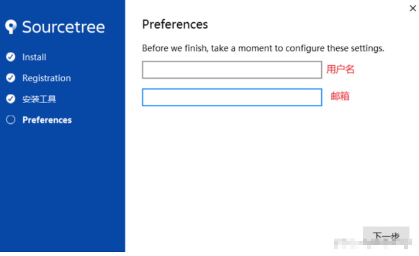

5.一般不配置SSH

> 提醒：一般来说拉取github有两种方式Http和SSH，许多人习惯了http，所以可以点击否，
>
> 1、使用SSH拉取代码，验证需要SSH秘钥验证
>
> 2、使用Http拉取代码，验证身份需要账号密码

	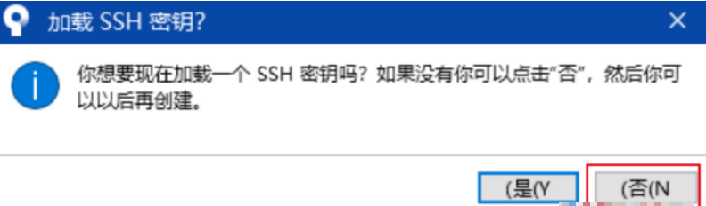

6.最后

	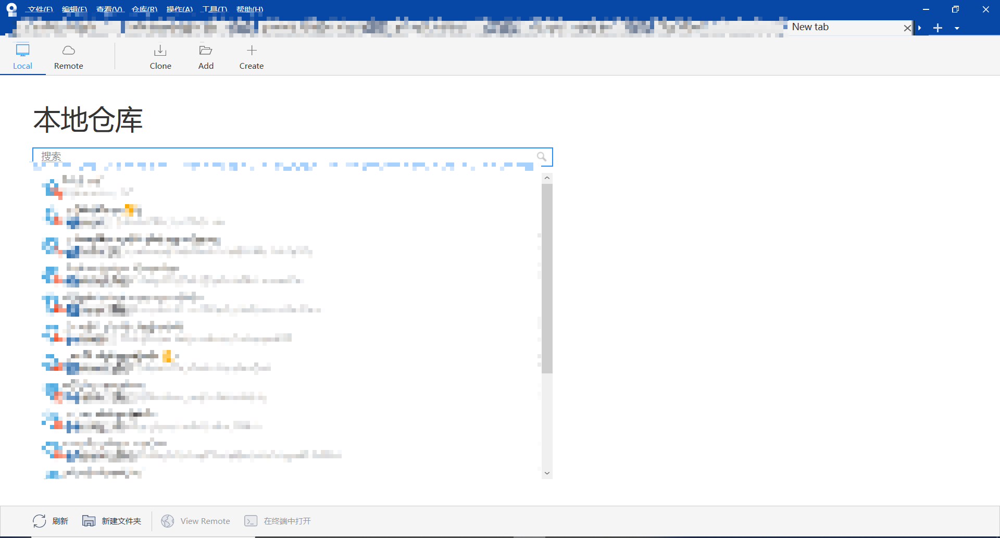

## 四、source使用方法

### 前言

	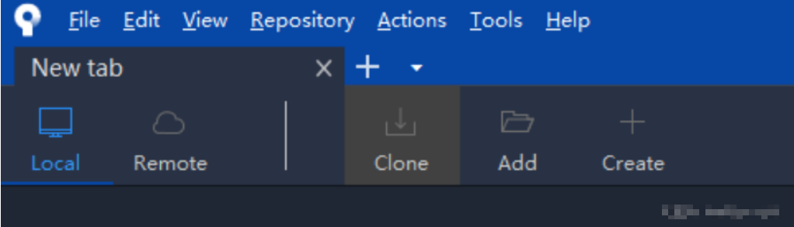

Local: 本地仓库

Remote：远程仓库

Clone：克隆远程仓库

Add：添加本地已有仓库

Create：创建仓库

### 4.1创建仓库

1.输入创建仓库的信息

	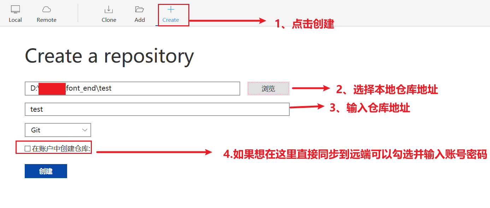

2.创建后本地目录

	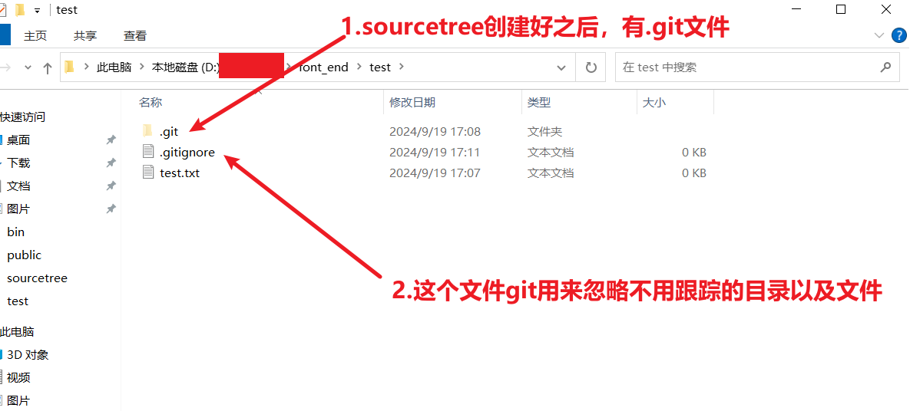

3.创建后sourcetree展示区

	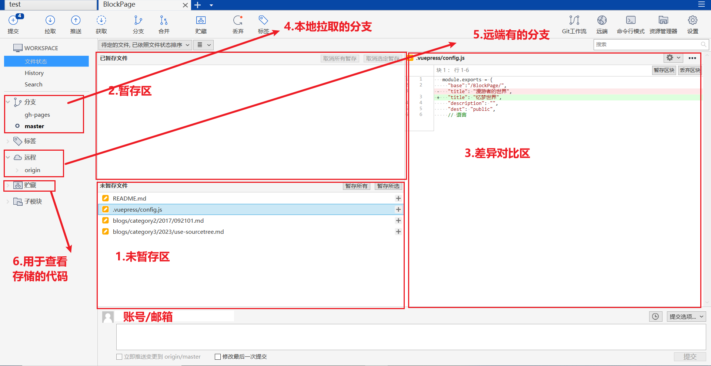

### 4.2提交

1.提交

	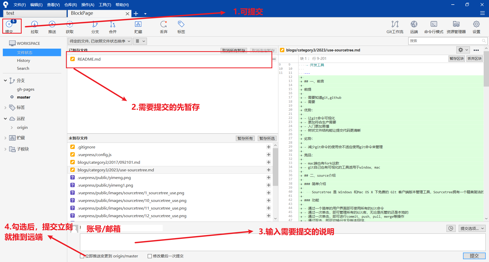

2.查看提交历史

	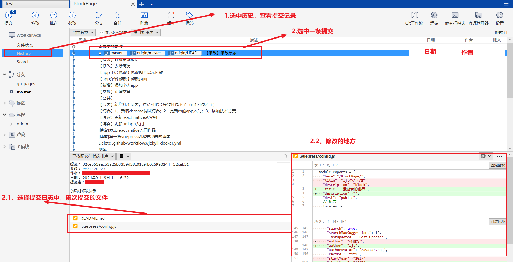

### 4.3推送

1.本地新建仓库未推送过

	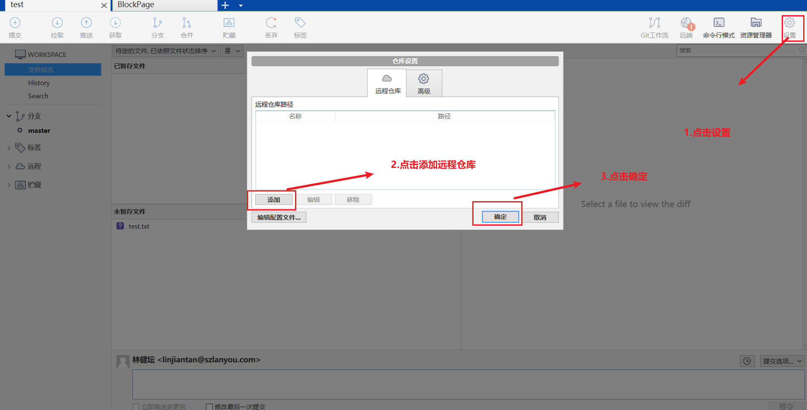

2.远程有仓库推送

	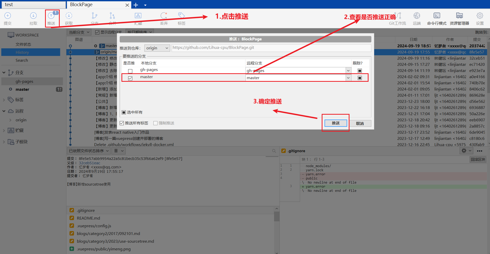

### 4.4 clone（克隆）下来

1.填写仓库地址

	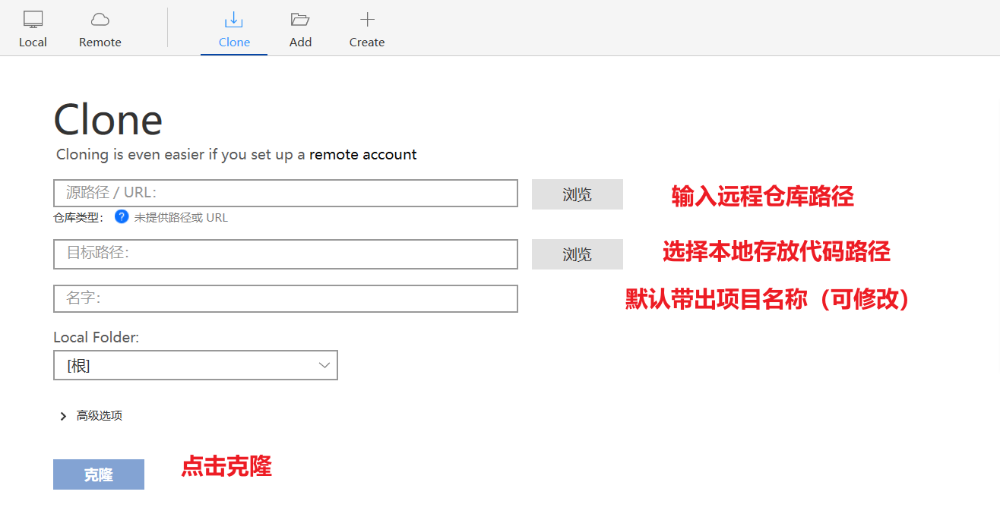

2.确认仓库后可配置

	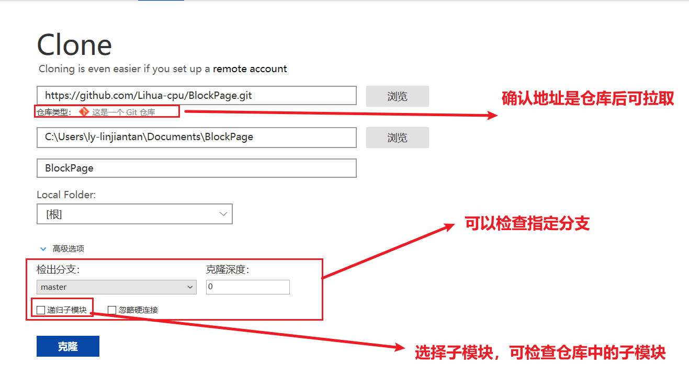

### 4.5拉取分支

> 针对远端已经有仓库，需要拉取其他分支

1、检出新分支

	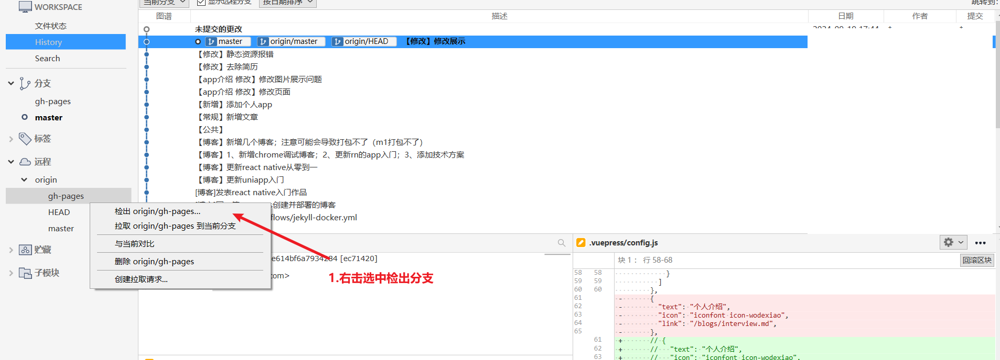

2、确定检出新分支

	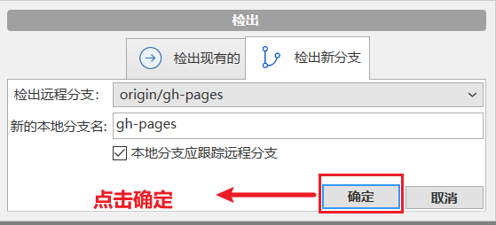

### 4.6添加分支

常用分支策略如下：

一般会分为三种分支，分别是主分支（master），开发分支（develop）和修补bug分支（fixbug）。

代码库应该有一个、且仅有一个主分支。所有提供给用户使用的正式版本，都在这个主分支上发布。

主分支只用来分布重大版本，日常开发应该在另一条分支上完成。但是实际生产钟除了这几个，还会有灰度环境分支、业务测试分支等

1.本地新建分支

	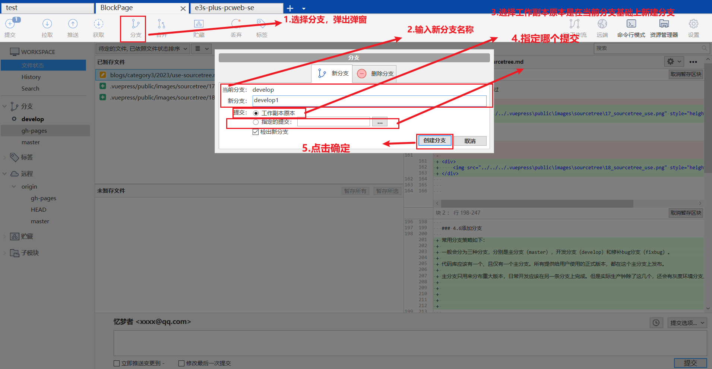

2.推到远程

### 4.7切换分支

### 4.8合并

### 4.9解决冲突

### 4.10删除分支

### 4.11撤回

### 4.12回滚

## 五、总结

- 一般来说使用最多的是clone、checkout、合并、拉取分支、回滚、pull、push
- 一般来说小编习惯结合vscode来解决代码冲突（面对冲突时vscode可以识别并快速解决）

## 六、常见问题

### 6.1关于多方式拉取导致问题

描述：小编遇到过多方式SSH、http拉取的时候会导致sourcetree等其他，更新、push代码的时候每次都需要验证，这样大大降低git的便利性

解决：小编用git命令解决，具体是用配置了针对http拉取代码的仓库，设置了保存账号密码的配置（具体仓库读取具体仓库配置，不依赖全局git配置）

原理：git允许多方式拉代码，如果配置了多方式会导致git无法可能校验身份，所以导致每次拉去代码需要输入账号密码

其他解决：1、git提供了规则拉取，可以去设置规则；2、具体仓库读取具体仓库配置

## 七、参考

1、https://blog.csdn.net/weixin_35714547/article/details/134870504

​	

